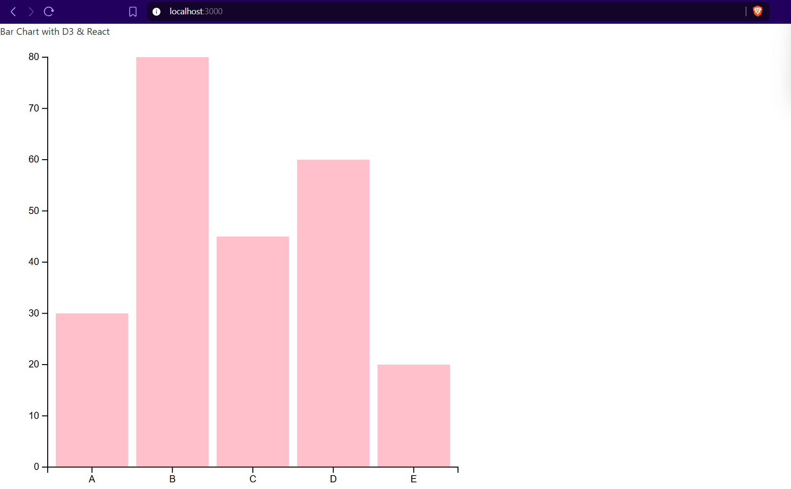

# Simple BarChart with D3

1. pnpm/npm install packages

2. create src/components/App1.tsx
    - add a header "Bar Chart with D3 & React"
    - insert into main.tsx
    - start the server to see all is well (pnpm/npm dev)

3. create your src/components/BarChart/BarChart1.tsx file
    - import and use in App.tsx
    - send the following data into the BarChart1 comp
      ```ts
        const sampleData = [
            { name: "A", value: 30 },
            { name: "B", value: 80 },
            { name: "C", value: 45 },
            { name: "D", value: 60 },
            { name: "E", value: 20 }
        ];
      ```
    - also send the width and height of the svg into the BarChart1.tsx
    - start working on your barChart

4. test that everything works fine
    - commit all changes made to github

5. clean up
    - shut down the server
    - delete App1.tsx, BarChart1.tsx, node_modules

<br>
<br>

# Final result should look like:
